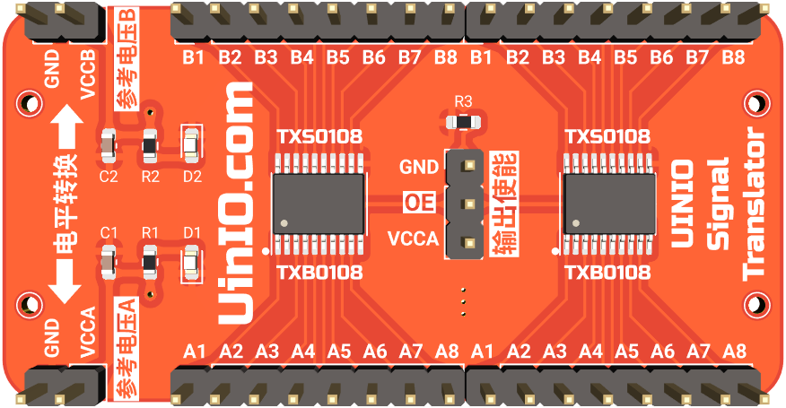
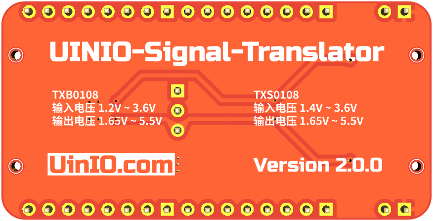

# UINIO-Signal-Translator 信号电平转换器

[**UINIO-Signal-Translator**](https://github.com/uinika/UINIO-Signal-Translator) 是一款基于德州仪器 TSSOP 封装的 [**TXS0108**](https://www.ti.com.cn/product/cn/TXS0108E) 以及 [**TXB0108**](https://www.ti.com.cn/product/cn/TXB0108) 的双向电平信号转换器模组，适用于漏极开路或者推挽输出的应用，支持 `1.8V`、`2.5V`、`3.3V`、`5V` 等常见信号电平之间的相互转换。

- **TXB0108**：`VCCA` 端电压 `1.2V ~ 3.6V`，`VCCB` 端电压 `1.65V ~ 5.5V`，使能端 `OE` 高电平有效。不能用于 I²C 的开漏输出，只适用于 **UART** 与 **SPI** 总线通信场景。
- **TXS0108**：`VCCA` 端电压 `1.4V ~ 3.6V`，`VCCB` 端电压 `1.65V ~ 5.5V`，使能端 `OE` 高电平有效，同时支持开漏与推挽输出（推挽模式下最大数据速率可以达到 `110Mbps`，开漏模式下则只能达到 `1.2Mbps`），可以同时适用于 **UART**、**I²C**、**SPI** 等总线通信场景。

> **注意**： **TXS0108** 和 **TXB0108** 两款芯片只能完成逻辑电平信号的转换，其驱动能力较小，并不具备带负载能力。
